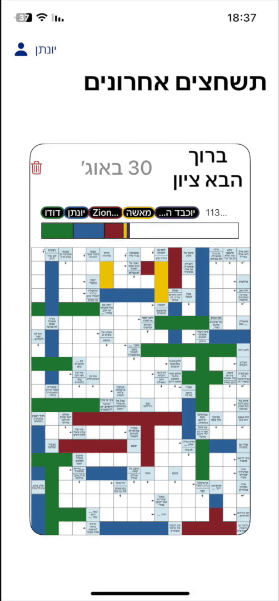
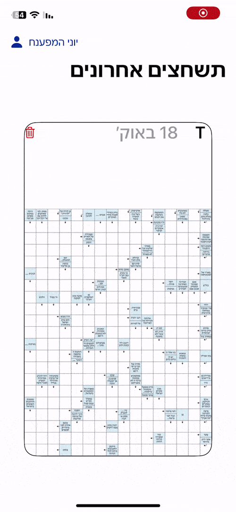
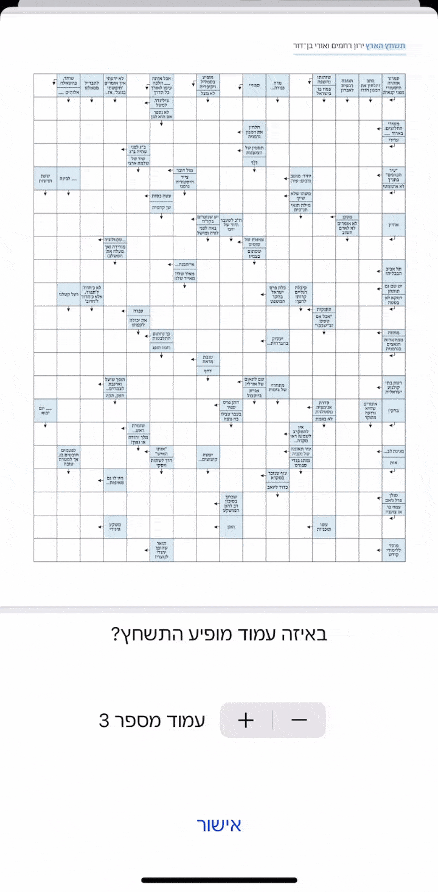
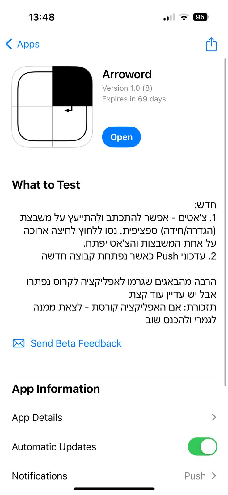

# Arroword (Collaborative Puzzle App) — Preview

**Arroword** is a real-time, collaborative arrow-word puzzle-solving app for iOS built with SwiftUI and Firebase.  
It brings **live presence collaboration** — similar to real-time document editing — to the world of arrow-word puzzles.

Users can upload a puzzle (from image, PDF, or live scan), invite friends, and solve it together — with each participant’s contributions shown live on the board in real time.

---
## ✨ Key Features

<table>
<tr>
<td width="55%">

<h3>1. <strong>Real-Time Collaborative Solving</strong></h3>

Multiple users solve the same puzzle together in real time.  
Each participant is assigned a unique color, which clearly communicates:
<ul>
<li>Where they are currently focused</li>
<li>Which cells they have filled</li>
<li>Which clue/path they are working on</li>
</ul>

State is synchronized using Firestore listeners, so all participants see updates instantly — with no manual refresh.

</td>

<td width="45%" align="center">
  <table>
    <tr>
      <td align="center"></td>
      <td align="center"></td>
    </tr>
  </table>
</td>

</tr>
</table>

---

<table>
<tr>
<td width="55%">

<h3>2. <strong>Lobby View & Collaborative Gamification</strong></h3>

All active puzzles appear in the main lobby as cards, each showing a compact visual summary of the group’s progress:

<ul>
<li>A <b>minimap</b> of the board, with solved cells color-coded by the member who filled them.</li>
<li><b>Member badges</b> above the minimap, ordered by contribution.</li>
<li>A <b>stacked progress bar</b> illustrating both overall completion and each member’s share.</li>
</ul>

This allows players to see progress at a glance and encourages friendly competition, while remaining lightweight through <b>lazy loading</b> and <b>local snapshot caching</b>.

</td>

<td width="45%" align="center">

</td>

</tr>
</table>

---

<table>
<tr>
<td width="55%">

<h3>3. <strong>Puzzle Upload & Board Recognition</strong></h3>

Users can start a new shared puzzle group by importing:
<ul>
<li>A <b>photo</b> from the gallery</li>
<li>A <b>PDF document</b> with page selection (as shown to the right)</li>
<li>A <b>live scan</b> using VisionKit</li>
</ul>

Arroword then automatically detects the puzzle’s grid dimensions and initializes a structured puzzle board.

</td>
<td align="right">

</td>
</tr>
</table>

---

<table>
<tr>
<td width="55%">

<h3>4. <strong>Automatic Puzzle Grid Detection</strong></h3>

After a puzzle file, scan, or image is selected, Arroword automatically detects the <b>grid dimensions</b> and distinguishes <b>definition cells</b> from <b>answer cells</b>.
The puzzle is then converted into a precise, coordinate-indexed grid model.

This enables:
<ul>
<li>Pixel-accurate zoom & pan</li>
<li>Consistent rendering across device sizes</li>
<li>Selectable clue paths with direction toggling</li>
<li>A smooth, touch-native solving experience</li>
</ul>

Any printed puzzle becomes a fully interactive, cell-accurate board — ready for collaborative play.

</td>
<td align="right">

</td>
</tr>
</table>

---

<table>
<tr>
<td width="55%">

<h3>5. <strong>Deployment & Beta Testing (TestFlight)</strong></h3>

Arroword has been distributed privately through **TestFlight** for real-world testing with multiple users.
This allowed refinement of:
<ul>
<li>Interaction flow and control responsiveness</li>
<li>Real-time synchronization behavior across devices</li>
<li>Performance on different device sizes and OS versions</li>
</ul>

This ensures the app performs reliably outside the simulator and under real network conditions.

</td>

<td width="45%" align="center">

</td>

</tr>
</table>

---

## 🔭 Upcoming Feature: Per-Riddle Chat

A built-in chat system is being developed, allowing members to discuss specific clues directly on the board.  
A long-press on a cell opens a chat scoped to that clue’s context.  
This feature is currently being tested in private TestFlight builds and iterated based on user feedback.

---
## 📌 Project Status

Arroword is an active project in ongoing development.  
The core real-time collaboration, gameplay flow, and lobby experience are implemented and tested with real users through private TestFlight distribution.  
The codebase is private while the app is being prepared for broader release.

If you're evaluating this project for a role or collaboration, I’d be happy to walk through architecture and implementation details in conversation.

## Project Overview

This repository provides a visual walkthrough of the app in its current development stage.  
The codebase remains private while the app is being prepared for release, but the preview demonstrates the core features, collaborative interactions, and system design.

---

## 📌 Status

Active project in ongoing development.  
The core architecture, UI workflows, and collaborative systems are implemented and refined based on real-world testing.  
The codebase is private while preparing for broader release.

If you're reviewing this in the context of a job application, I’d be glad to walk through selected implementation details in conversation.

---

## 👋 Author

**Jonatan Vider**  
iOS & Product Developer — Tel Aviv, Israel
