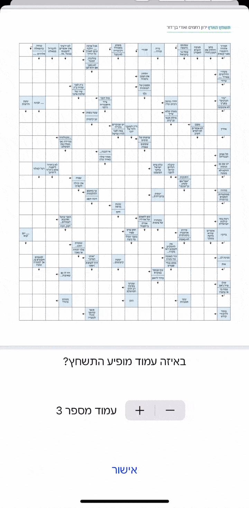
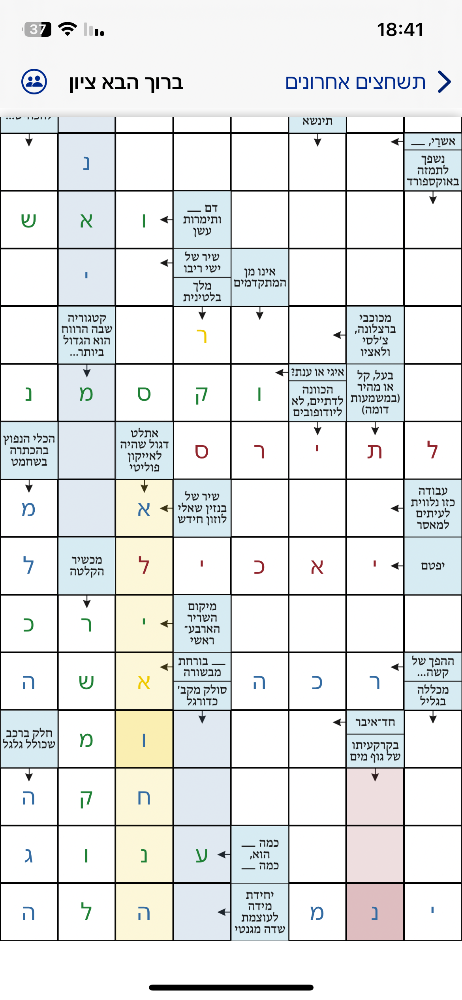

# Arroword (Collaborative Arrow-Word Puzzle App) — Preview

**Arroword** is a real-time, collaborative *arrow-word puzzle* solving app built for iOS using **SwiftUI** and **Firebase**.  
Users can upload a puzzle (from image, PDF, or live camera scan), share it with friends, and solve it together — with each participant’s progress shown live on the board.

This repository provides a **visual overview and product walkthrough** of the app in its current in-development state.  
The full codebase remains private while the app is prepared for release, but this preview demonstrates the core features, UI patterns, system design, and collaborative logic.

---

## 🎥 Demo Video (1 min)

> **Video Link:** *(upload YouTube as Unlisted and replace this line)*  
> `https://youtu.be/PLACEHOLDER`

---

## ✨ Key Features

<table>
<tr>
<td width="55%">

<h3>1. <strong>Puzzle Upload & Board Recognition</strong></h3>

Users can start a new shared puzzle group by importing:
<ul>
<li>A <b>photo</b> from the gallery</li>
<li>A <b>PDF document</b> with page selection  (Like in this instance ---->)</li>
<li>A <b>live scan</b> using VisionKit</li>
</ul>

Arroword then automatically detects the puzzle’s grid dimensions and initializes a structured board.

</td>
<td align="right">

</td>
</tr>
</table>

-------------------------------------------------------------------------------------

Once imported, Arroword automatically **detects the puzzle’s grid dimensions** and initializes a structured puzzle board.

---------------------------------------------------------------------------------------------------------

<table>
<tr>
<td width="55%">

<h3>2. <strong>Automatic Puzzle Grid Detection</strong></h3>

After the puzzle image or PDF page is selected, Arroword automatically analyzes the layout to detect the <b>exact grid dimensions</b> and classify each cell as either a <b>clue cell</b> or an <b>answer cell</b>. The puzzle is then converted into a precise, coordinate-indexed grid data model.

This enables:
<ul>
<li>Pixel-accurate cell boundaries during zoom and pan</li>
<li>Stable rendering across device sizes and orientations</li>
<li>Reliable cell selection and directional highlight behavior</li>
<li>A clean, touch-native puzzle interaction experience</li>
</ul>

The result is that <i>any</i> puzzle — scanned, photographed, or imported — becomes a fully interactive, cell-level puzzle board ready for collaborative solving.

</td>
<td align="right">

</td>
</tr>
</table>

---

### 2. **Real-Time Collaborative Solving**
Multiple members solve the same puzzle *together* — live.

Each member is assigned a unique **identity color**, used throughout the UI to show:
- Which clue each person is currently focused on
- Which cell they are editing right now
- Which letters were contributed by each member

This provides **Google-Docs-style presence**, but for puzzle solving.

> Demonstrates: Firebase Firestore real-time listeners, shared editing state modeling, SwiftUI state diffing.

**Screenshot:**  

  

`/screenshots/realtime_board.PNG`

---

### 3. **Contribution Visualization & Gamification**
The lobby displays a **“minimap” puzzle preview** where each filled cell is shown in the contributor’s color — making progress and collaboration clear at a glance.

Above it, a **color-coded member list** and **stacked bar contribution meter** display how much each user has contributed.

This lightweight gamification drives:
- Friendly competition  
- Engagement  
- Clear progress visibility  

> Demonstrates: Custom drawing in SwiftUI, local snapshot caching, incremental data aggregation, product design thinking.

**Screenshot:**  
`/screenshots/minimap_overview.PNG`

---

### 4. **Smooth Interaction & Puzzle Input**
On tapping a cell:
- The full clue path highlights in the user’s color
- A custom Hebrew keyboard slides up
- Other participants see the highlight live

> Demonstrates: gesture recognition, custom overlay inputs, clue traversal algorithms, bidirectional grid-to-model mapping.

**Screenshot:**  
`/screenshots/focus_and_keyboard.PNG`

---

### 5. **Deployment & Beta Testing (TestFlight)**
Arroword has been distributed privately through **TestFlight** for group testing and iteration.

This ensures real device performance evaluation, UX refinement, and real multi-user stress testing.

**Screenshot:**  
`/screenshots/testflight_builds.PNG`

> Demonstrates: App signing, provisioning, TestFlight deployment, OTA beta distribution.

---

## 🛠️ Tech Stack

| Layer | Technology |
|---|---|
| Language | **Swift**, SwiftUI |
| Realtime backend | **Firebase Firestore** |
| Storage & caching | Firebase Storage, local persistence |
| Document handling | PDFKit, UIKit bridging |
| Scanning / imaging | VisionKit, CoreImage processing |
| Collaboration model | Color-coded shared edit state w/ presence |
| Deployment | TestFlight beta distribution |

---

## 📌 Status

This is an ongoing project in active development.  
The core architecture, workflows, and UI systems are implemented and functioning in production-like conditions with real testers.

The codebase is currently private while the app is prepared for wider release.

If you're evaluating this project in the context of a job application, I’d be happy to **walk through the architecture and selected portions of the code live** in an interview or technical conversation.

---

  

## 👋 Author

**Jonatan Vider**  
iOS & Product Developer  
Tel Aviv, Israel
